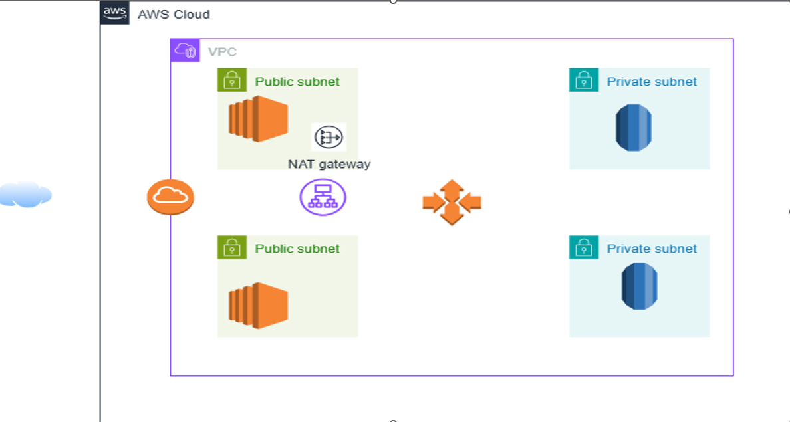
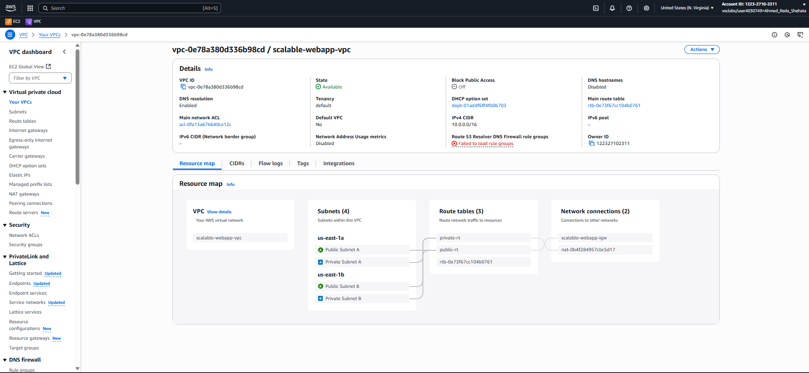
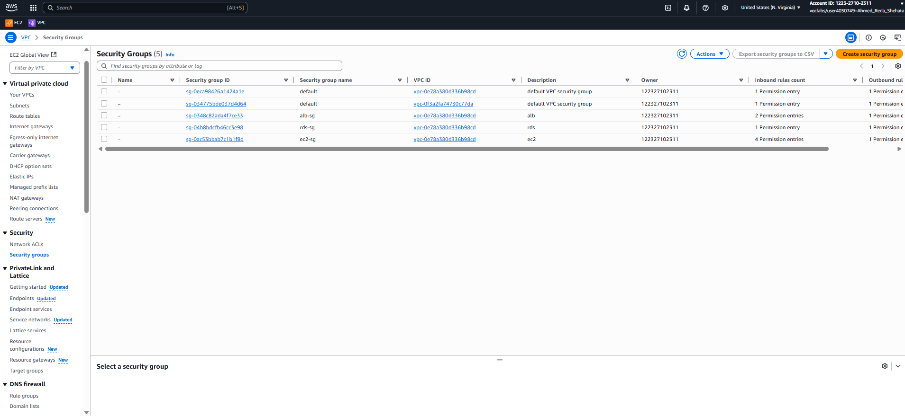
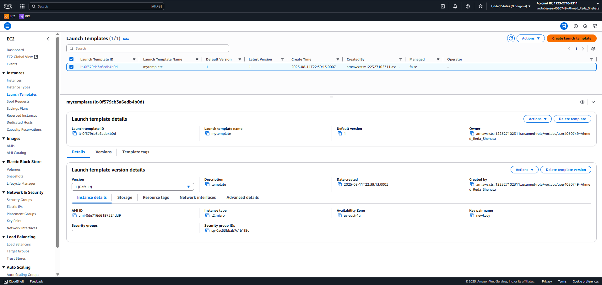
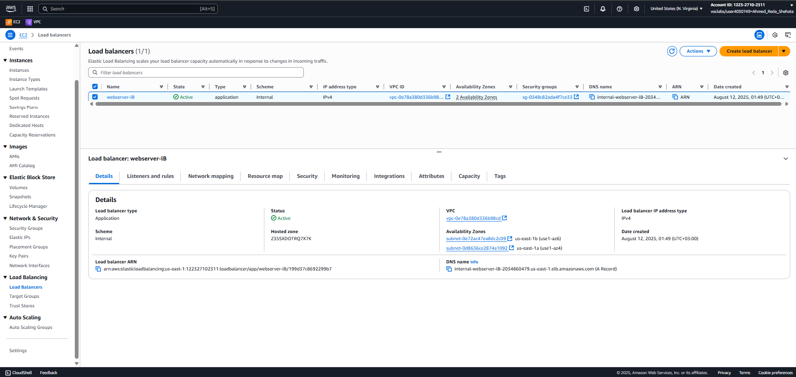
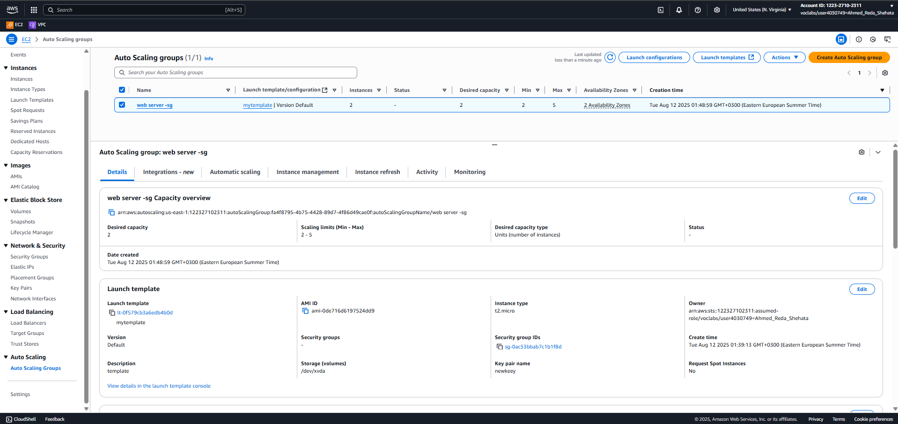
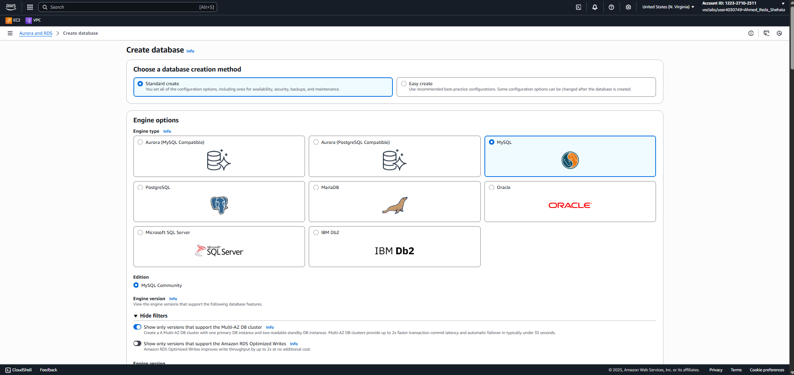
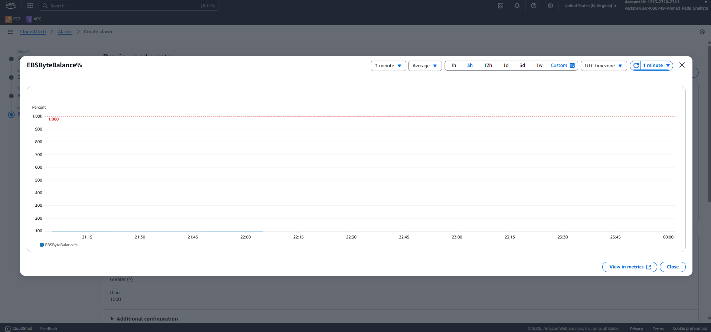

Deployment of a Scalable Web Application on AWS
Table of Contents
•	Overview
•	Architecture Diagram
•	Deployment Steps

1. Overview

This project demonstrates the deployment of a highly available, scalable, and monitored web application on AWS.
It leverages key AWS services, including:

1-EC2 for hosting the application.

2-Application Load Balancer (ALB) for traffic distribution.

3-Auto Scaling Group (ASG) for automatic scaling.

4-Amazon RDS for database hosting with Multi-AZ support.

5-IAM for secure role-based access.

6-CloudWatch & SNS for monitoring and alerting.

The architecture ensures performance, fault tolerance, cost optimization, and operational visibility.

2. Architecture Description

•	Application Load Balancer (ALB):

Deployed in public subnets to receive incoming HTTP/HTTPS traffic and forward it to EC2 instances.

•	EC2 Instances:

Deployed across two Availability Zones in private subnets for high availability.

Managed by an Auto Scaling Group to dynamically adjust capacity based on demand.

•	Security Groups:

ALB-SG: Allows HTTP/HTTPS traffic from the internet.

EC2-SG: Allows traffic only from ALB-SG.

DB-SG: Allows MySQL traffic only from EC2-SG.

•	Database Layer:

Amazon RDS (MySQL) with Multi-AZ deployment for failover protection.

•	IAM Role:

Grants EC2 access to Secrets Manager (for DB credentials) and CloudWatch.

•	Monitoring:

CloudWatch tracks metrics like CPU and instance count. SNS sends alerts when scaling limits are reached.

3. Deployment Steps

•	Step 1 – Networking Setup

Create VPC, subnets (public & private), and Internet Gateway.

Configure Route Tables and associate them with respective subnets.

•	Step 2 – Security Configuration

ALB Security Group: Allow inbound HTTP/HTTPS from anywhere.

EC2 Security Group: Allow inbound HTTP/HTTPS from ALB-SG only.

DB Security Group: Allow MySQL/Aurora inbound from EC2-SG only.

Create an IAM Role with:

SecretsManagerReadWrite

AmazonEC2ReadOnlyAccess

CloudWatchAgentServerPolicy

AmazonSSMManagedInstanceCore

•	Step 3 – Launch Template

AMI: Amazon Linux 2

Instance Type: t2.micro

Security Group: EC2-SG

IAM Role: As created above

User Data: Install Apache and deploy application files.

•	Step 4 – Load Balancer Setup

Create an Application Load Balancer (Internet-facing) in public subnets.

Select ALB-SG for security.

Create a Target Group for the application and attach it to the ALB.

•	Step 5 – Auto Scaling Group

Create ASG using the launch template.

Deploy in two public subnets (different AZs).

Attach the ALB to the ASG.

Enable group metrics collection in CloudWatch.

•	Step 6 – Database Setup

Create a DB Subnet Group (private subnets).

Deploy MySQL RDS with Multi-AZ enabled.

Select DB-SG for security.

Store credentials in Secrets Manager.

•	Step 7 – Monitoring & Alerts

Create an SNS topic "alarm" and subscribe via email.

In CloudWatch, create an Alarm:

Metric: GroupTotalInstances from ASG

Condition: Greater than or equal to 6 instances

Action: Send notification to SNS topic.

✅ Final Result:

A fully functional dynamic web application hosted on AWS, with:

High availability via ALB & Multi-AZ.

Scalability via Auto Scaling.

Security via role-based access & SGs.

Monitoring & Alerts via CloudWatch & SNS.

## Author

- [GitHub](https://github.com/username)
- [LinkedIn](https://www.linkedin.com/in/username/)

